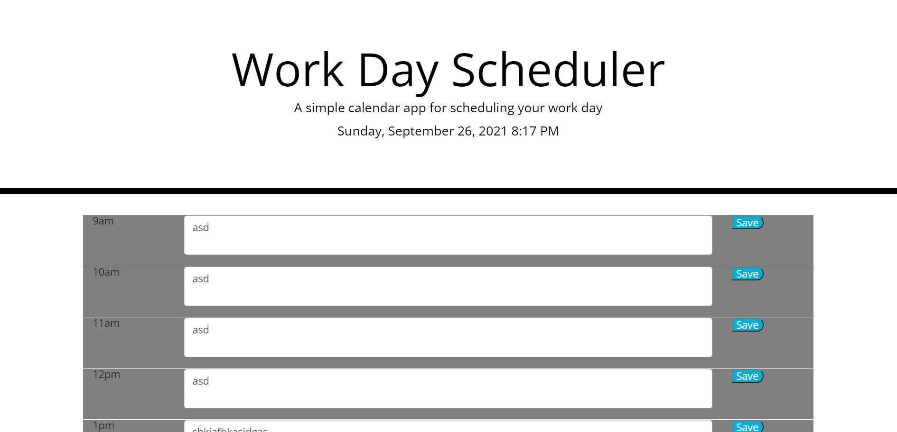

# Homework5-WorkDayScheduler
Homework 5: 3rd Party APIs - Work Day Scheduler.

Description: This application allows users to plan out their 9am to 5pm schedule by typing information into each 1 hour time block. Information saved into each 1 hour time block will remain in the user's local storage and will be accessable in their browser until midnight each night.
    This application uses jQuery and momentJS.

Finished App Screenshot: 

Link to Deployed Application: https://calvinswomley.github.io/Homework5-WorkDayScheduler/

Contact: Calvin Swomley | calvinswomley@gmail.com

Copyright (c) 2021-2026 Calvin Swomley and others

Permission is hereby granted, free of charge, to any person obtaining
a copy of this software and associated documentation files (the
"Software"), to deal in the Software without restriction, including
without limitation the rights to use, copy, modify, merge, publish,
distribute, sublicense, and/or sell copies of the Software, and to
permit persons to whom the Software is furnished to do so, subject to
the following conditions:

The above copyright notice and this permission notice shall be
included in all copies or substantial portions of the Software.

THE SOFTWARE IS PROVIDED "AS IS", WITHOUT WARRANTY OF ANY KIND,
EXPRESS OR IMPLIED, INCLUDING BUT NOT LIMITED TO THE WARRANTIES OF
MERCHANTABILITY, FITNESS FOR A PARTICULAR PURPOSE AND
NONINFRINGEMENT. IN NO EVENT SHALL THE AUTHORS OR COPYRIGHT HOLDERS BE
LIABLE FOR ANY CLAIM, DAMAGES OR OTHER LIABILITY, WHETHER IN AN ACTION
OF CONTRACT, TORT OR OTHERWISE, ARISING FROM, OUT OF OR IN CONNECTION
WITH THE SOFTWARE OR THE USE OR OTHER DEALINGS IN THE SOFTWARE.
